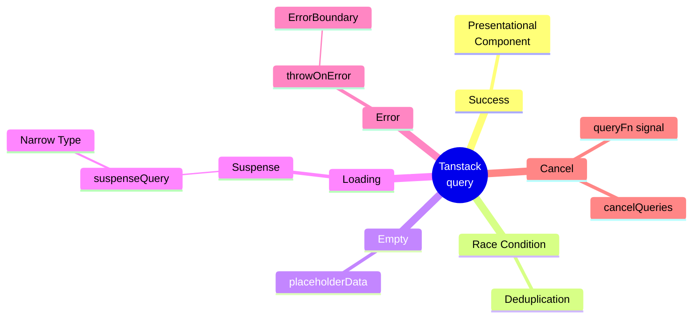

# Async state

## 참고 자료
- [TkDodo Blog | Why You Want Need React Query](https://tkdodo.eu/blog/why-you-want-react-query)
- [React Docs | useEffect](https://react.dev/reference/react/useEffect#fetching-data-with-effects)