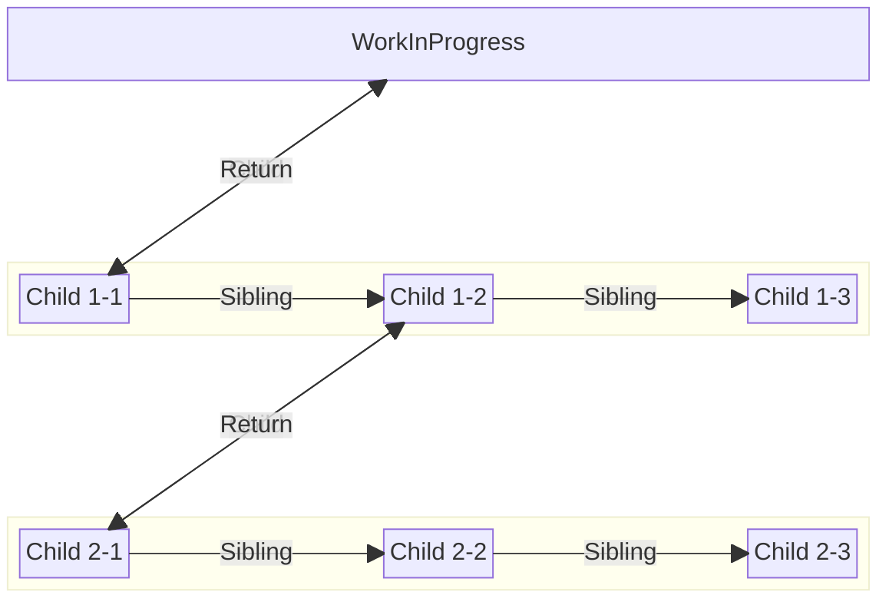
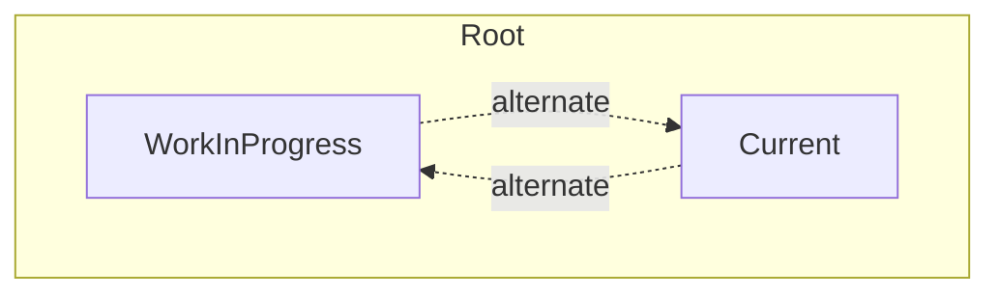

# React-reconciler | Fiber tree (19.0.0)

## LCRS tree
Fiber는 LCRS tree로 이루어져 있으며 LCRS(Left Child Right Sibling) tree는 `Fiber` 노드들을 효율적으로 연결하는 방식입니다. [(Fiber 알아보기)](/blog/react/reconciler-fiber)

- **Return:** `return` 속성은 부모 `Fiber` 노드를 가리킵니다.
- **Left Child:** `child` 속성을 통해 첫 번째 자식 `Fiber` 노드를 가리킵니다.
- **Right Sibling:** `sibling` 속성을 사용하여 공통 부모를 가지면서 현재 `Fiber`의 동생 `Fiber` 노드를 가리킵니다.
- **Index:** `index` 속성을 사용해서 공통 부모를 갖는 형제 중 순서를 나타냅니다.


## 탐색 순서
```js filename="index.html"
<div id="root">
  <div>Child1-1</div>
  <div>
    Child1-2
    <div>Child2-1</div>
    <div>Child2-2</div>
    <div>Child2-3</div>
  </div>
  <div>Child1-3</div>
</div>
```
다음과 같은 구조를 갖는다고 가정해보겠습니다.


탐색 순서는 다음과 같습니다.
1. WorkInProgress (root)에서 `child` 노드(child1-1)로 이동
2. 현재 위치(child1-1)에서 `child`가 없으므로 `sibling` 속성을 사용하여 `sibling` 노드(child1-2)로 이동
3. 현재 위치(child1-2)에서 `child` 속성을 사용하여 `child` 노드(child2-1)로 이동
4. 현재 위치(child2-1)에서 `child`가 없으므로 `sibling` 속성을 사용하여 `sibling` 노드(child2-2)로 이동
5. 현재 위치(child2-2)에서 `child`가 없으므로 `sibling` 속성을 사용하여 `sibling` 노드(child2-3)로 이동
6. 현재 위치(child2-3)에서 `child` , `sibling`이 없고 `index`가 0이 아니므로 이전 `sibling` 노드(child2-2)로 이동
7. 현재 위치(child2-2)에서 다음 `sibling` 노드(child2-3)의 탐색을 마쳤고 `index`가 0이 아니므로 이전 `sibling` 노드(child2-1)로 이동
8. 현재 위치(child2-1)에서 다음 `sibling` 노드(child2-2)의 탐색을 마쳤고 `index`가 0이므로 `return` 노드(child1-2)로 이동
9. 현재 위치(child1-2)에서 다음 `sibling` 노드(child2-2)의 탐색을 마치지 않아 `sibling` 노드(child1-3)로 이동
10. 현재 위치(child1-3)에서 `child` , `sibling`이 없고 `index`가 0이 아니므로 이전 `sibling` 노드(child1-2)로 이동
11. 현재 위치(child1-2)에서 다음 `sibling` 노드(child1-3)의 탐색을 마쳤고 `index`가 0이 아니므로 이전 `sibling` 노드(child1-1)로 이동
12. 현재 위치(child1-1)에서 다음 `sibling` 노드(child1-2)의 탐색을 마쳤고 `index`가 0이므로 `return` 노드(root)로 이동


## Current, WorkInProgress tree


흔히 말하는 virtual DOM은 Current, WorkInProgress 2개의 tree를 갖는 더블 버퍼링 구조입니다.

**Current**
- 화면에 반영된 상태의 tree입니다.
- 업데이트를 시작할때 Current의 `alternate` 값으로 WorkInProgress에 대입합니다.
```js filename="react/packages/react-reconciler/src/ReactFiber.js" /current.alternate/"
export function createWorkInProgress(current: Fiber, pendingProps: any): Fiber {
  let workInProgress = current.alternate;
  ...
  if (workInProgress === null) {
    ...
    workInProgress.alternate = current;
    current.alternate = workInProgress;
  }
}
```

**WorkInProgress**
- 화면에 반영할 상태의 tree입니다.
- 업데이트를 마치면 WorkInProgress가 Current가 됩니다.
```js filename="react/packages/react-reconciler/src/ReactFiberWorkLoop.js" /{7,8}/"
function commitRootImpl(
  root: FiberRoot,
  ...
) {
  const finishedWork = root.finishedWork;
  ...
  // The work-in-progress tree is now the current tree. This must come after
  root.current = finishedWork;
}
```

위 예시에서는 Root에서 참조하지만 자식 노드에도 `alternate` 값을 통해 양쪽 트리에서 참조할 수 있습니다.

## 참고 자료
[Mathpresso | Blog](https://blog.mathpresso.com/react-deep-dive-fiber-88860f6edbd0)