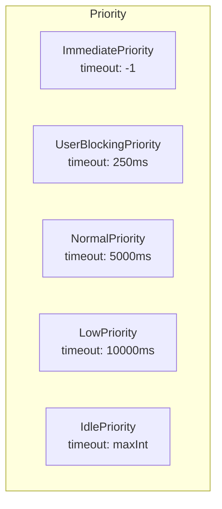
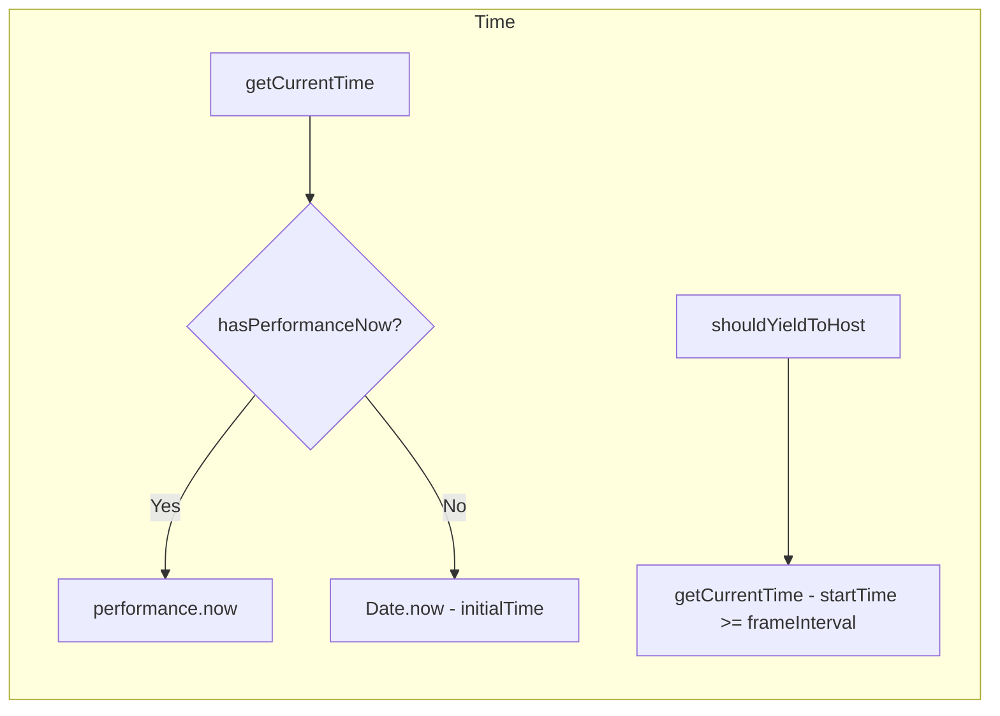
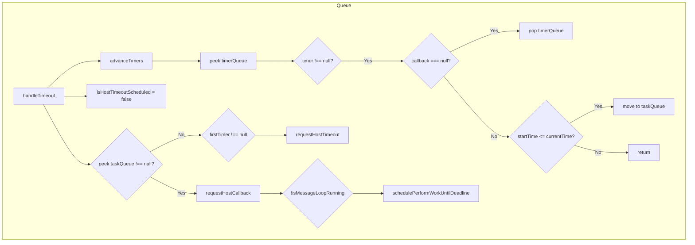
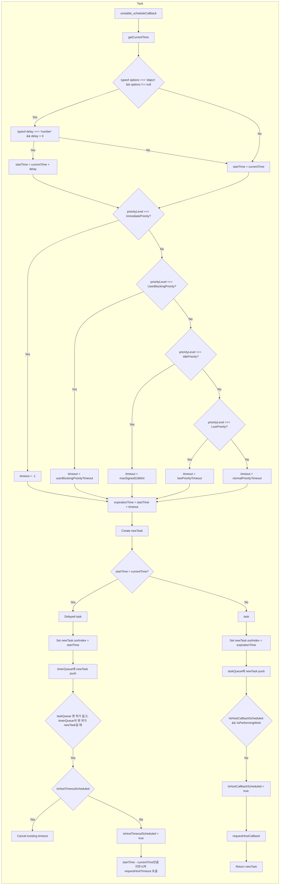

# React Scheduler (19.0.0)

## SchedulerFeatureFlags

```js filename="react/packages/scheduler/src/SchedulerFeatureFlags.js"
export const frameYieldMs = 5;
export const userBlockingPriorityTimeout = 250;
export const normalPriorityTimeout = 5000;
export const lowPriorityTimeout = 10000;
```

### `frameYieldMs`
5ms 간격으로 메인 스레드가 차단되지 않도록 양보합니다. (부드러운 사용자 경험을 제공하기 위해 React는 **60fps**(**16.67ms**) 이내에 렌더링되는 것을 권장합니다.)

### `userBlockingPriorityTimeout`
[Lane](/blog/react/reconciler/lane) 모델에서 `SyncLane`(사용자 상호작용), `InputContinuousLane` (사용자 입력)이 있는 경우 최대 250ms 대기 시간을 갖습니다.

### `normalPriorityTimeout`
기본적으로 최대 5000ms 대기 시간을 갖습니다.

### `lowPriorityTimeout`
[Lane](/blog/react/reconciler/lane) 모델에서 `IdleLane`(CPU 유휴 상태)일때 최대 10000ms 대기 시간을 갖습니다.

## SchedulerPriorities

```js filename="react/packages/react-reconciler/src/ReactEventPriority.js"
export const NoEventPriority: EventPriority = NoLane;
export const DiscreteEventPriority: EventPriority = SyncLane;
export const ContinuousEventPriority: EventPriority = InputContinuousLane;
export const DefaultEventPriority: EventPriority = DefaultLane;
export const IdleEventPriority: EventPriority = IdleLane;
```

```js filename="react/packages/react-reconciler/src/ReactFiberRootScheduler.js"
function scheduleTaskForRootDuringMicrotask(
  root: FiberRoot,
  currentTime: number,
): Lane {
  ...
  // Scheduler does have an "ImmediatePriority", but now that we use
  // microtasks for sync work we no longer use that. Any sync work that
  // reaches this path is meant to be time sliced.
  switch (lanesToEventPriority(nextLanes)) {
    case DiscreteEventPriority:
    case ContinuousEventPriority:
      schedulerPriorityLevel = UserBlockingSchedulerPriority;
      break;
    case DefaultEventPriority:
      schedulerPriorityLevel = NormalSchedulerPriority;
      break;
    case IdleEventPriority:
      schedulerPriorityLevel = IdleSchedulerPriority;
      break;
    default:
      schedulerPriorityLevel = NormalSchedulerPriority;
      break;
  }
  ...
}
```

```js filename="react/packages/scheduler/src/SchedulerPriorities.js"
export type PriorityLevel = 0 | 1 | 2 | 3 | 4 | 5;
export const NoPriority = 0;
export const ImmediatePriority = 1;
export const UserBlockingPriority = 2;
export const NormalPriority = 3;
export const LowPriority = 4;
export const IdlePriority = 5;
```

### `ImmediatePriority`
더 이상 사용되지 않는 우선순위입니다. 즉각적인 우선순위가 필요할 때 [queueMicrotask](https://developer.mozilla.org/en-US/docs/Web/API/Window/queueMicrotask)를 사용합니다.

### `UserBlockingPriority`
[Lane](/blog/react/reconciler/lane) 모델에서 `SyncLane`(사용자 상호작용), `InputContinuousLane` (사용자 입력)이 있는 경우 Scheduler에서 해당 우선순위를 갖습니다.

### `NormalPriority`
[Lane](/blog/react/reconciler/lane) 모델에서 `DefaultLane`(리액트 외부(fetch, setTimeout 등)에서 발생한 이벤트)일때 Scheduler에서 해당 우선순위를 갖습니다.

### `IdlePriority`
[Lane](/blog/react/reconciler/lane) 모델에서 `IdleLane`(CPU 유휴 상태)일때 Scheduler에서 해당 우선순위를 갖습니다.

## Scheduler
> 사용되지 않는 unstable, Profiling, 주석은 제거합니다.
```js filename="react/packages/scheduler/src/forks/Scheduler.js"
import type { PriorityLevel } from '../SchedulerPriorities';
import {
  frameYieldMs,
  userBlockingPriorityTimeout,
  lowPriorityTimeout,
  normalPriorityTimeout,
} from '../SchedulerFeatureFlags';
import { push, pop, peek } from '../SchedulerMinHeap';
import {
  ImmediatePriority,
  UserBlockingPriority,
  NormalPriority,
  LowPriority,
  IdlePriority,
} from '../SchedulerPriorities';

export type Callback = boolean => ?Callback;

export opaque type Task = {
  id: number,
  callback: Callback | null,
  priorityLevel: PriorityLevel,
  startTime: number,
  expirationTime: number,
  sortIndex: number,
  isQueued?: boolean,
};

let getCurrentTime: () => number | DOMHighResTimeStamp;
const hasPerformanceNow = typeof performance === 'object' && typeof performance.now === 'function';

if (hasPerformanceNow) {
  const localPerformance = performance;
  getCurrentTime = () => localPerformance.now();
} else {
  const localDate = Date;
  const initialTime = localDate.now();
  getCurrentTime = () => localDate.now() - initialTime;
}

const maxSigned31BitInt = 1073741823;

let taskQueue: Array<Task> = [];
let timerQueue: Array<Task> = [];
let taskIdCounter = 1;
let isSchedulerPaused = false;

let currentTask = null;
let currentPriorityLevel = NormalPriority;
let isPerformingWork = false;
let isHostCallbackScheduled = false;
let isHostTimeoutScheduled = false;

const localSetTimeout = typeof setTimeout === 'function' ? setTimeout : null;
const localClearTimeout = typeof clearTimeout === 'function' ? clearTimeout : null;
const localSetImmediate = typeof setImmediate !== 'undefined' ? setImmediate : null;

function advanceTimers(currentTime: number) {
  let timer = peek(timerQueue);
  while (timer !== null) {
    if (timer.callback === null) {
      pop(timerQueue);
    } else if (timer.startTime <= currentTime) {
      pop(timerQueue);
      timer.sortIndex = timer.expirationTime;
      push(taskQueue, timer);
    } else {
      return;
    }
    timer = peek(timerQueue);
  }
}

function handleTimeout(currentTime: number) {
  isHostTimeoutScheduled = false;
  advanceTimers(currentTime);

  if (!isHostCallbackScheduled) {
    if (peek(taskQueue) !== null) {
      isHostCallbackScheduled = true;
      requestHostCallback();
    } else {
      const firstTimer = peek(timerQueue);
      if (firstTimer !== null) {
        requestHostTimeout(handleTimeout, firstTimer.startTime - currentTime);
      }
    }
  }
}

function flushWork(initialTime: number) {
  isHostCallbackScheduled = false;
  if (isHostTimeoutScheduled) {
    isHostTimeoutScheduled = false;
    cancelHostTimeout();
  }

  isPerformingWork = true;
  const previousPriorityLevel = currentPriorityLevel;
  try {
    return workLoop(initialTime);
  } finally {
    currentTask = null;
    currentPriorityLevel = previousPriorityLevel;
    isPerformingWork = false;
  }
}

function workLoop(initialTime: number) {
  let currentTime = initialTime;
  advanceTimers(currentTime);
  currentTask = peek(taskQueue);
  while (currentTask !== null && !(enableSchedulerDebugging && isSchedulerPaused)) {
    if (currentTask.expirationTime > currentTime && shouldYieldToHost()) {
      break;
    }
    const callback = currentTask.callback;
    if (typeof callback === 'function') {
      currentTask.callback = null;
      currentPriorityLevel = currentTask.priorityLevel;
      const didUserCallbackTimeout = currentTask.expirationTime <= currentTime;
      const continuationCallback = callback(didUserCallbackTimeout);
      currentTime = getCurrentTime();
      if (typeof continuationCallback === 'function') {
        currentTask.callback = continuationCallback;
        advanceTimers(currentTime);
        return true;
      } else {
        if (currentTask === peek(taskQueue)) {
          pop(taskQueue);
        }
        advanceTimers(currentTime);
      }
    } else {
      pop(taskQueue);
    }
    currentTask = peek(taskQueue);
  }

  if (currentTask !== null) {
    return true;
  } else {
    const firstTimer = peek(timerQueue);
    if (firstTimer !== null) {
      requestHostTimeout(handleTimeout, firstTimer.startTime - currentTime);
    }
    return false;
  }
}

function unstable_scheduleCallback(
  priorityLevel: PriorityLevel,
  callback: Callback,
  options?: {delay: number},
): Task {
  var currentTime = getCurrentTime();

  var startTime;
  if (typeof options === 'object' && options !== null) {
    var delay = options.delay;
    if (typeof delay === 'number' && delay > 0) {
      startTime = currentTime + delay;
    } else {
      startTime = currentTime;
    }
  } else {
    startTime = currentTime;
  }

  var timeout;
  switch (priorityLevel) {
    case ImmediatePriority:
      timeout = -1;
      break;
    case UserBlockingPriority:
      timeout = userBlockingPriorityTimeout;
      break;
    case IdlePriority:
      timeout = maxSigned31BitInt;
      break;
    case LowPriority:
      timeout = lowPriorityTimeout;
      break;
    case NormalPriority:
    default:
      timeout = normalPriorityTimeout;
      break;
  }

  var expirationTime = startTime + timeout;

  var newTask: Task = {
    id: taskIdCounter++,
    callback,
    priorityLevel,
    startTime,
    expirationTime,
    sortIndex: -1,
  };

  if (startTime > currentTime) {
    newTask.sortIndex = startTime;
    push(timerQueue, newTask);
    if (peek(taskQueue) === null && newTask === peek(timerQueue)) {
      if (isHostTimeoutScheduled) {
        cancelHostTimeout();
      } else {
        isHostTimeoutScheduled = true;
      }
      requestHostTimeout(handleTimeout, startTime - currentTime);
    }
  } else {
    newTask.sortIndex = expirationTime;
    push(taskQueue, newTask);

    if (!isHostCallbackScheduled && !isPerformingWork) {
      isHostCallbackScheduled = true;
      requestHostCallback();
    }
  }

  return newTask;
}

function unstable_cancelCallback(task: Task) {
  task.callback = null;
}

function unstable_getCurrentPriorityLevel(): PriorityLevel {
  return currentPriorityLevel;
}

let isMessageLoopRunning = false;
let taskTimeoutID: TimeoutID = (-1: any);
let frameInterval = frameYieldMs;
let startTime = -1;

function shouldYieldToHost(): boolean {
  const timeElapsed = getCurrentTime() - startTime;
  return timeElapsed >= frameInterval;
}

const performWorkUntilDeadline = () => {
  if (isMessageLoopRunning) {
    const currentTime = getCurrentTime();
    startTime = currentTime;
    let hasMoreWork = true;

    try {
      hasMoreWork = flushWork(currentTime);
    } finally {
      if (hasMoreWork) {
        schedulePerformWorkUntilDeadline();
      } else {
        isMessageLoopRunning = false;
      }
    }
  }
};

let schedulePerformWorkUntilDeadline;
if (typeof localSetImmediate === 'function') {
  schedulePerformWorkUntilDeadline = () => {
    localSetImmediate(performWorkUntilDeadline);
  };
} else if (typeof MessageChannel !== 'undefined') {
  const channel = new MessageChannel();
  const port = channel.port2;
  channel.port1.onmessage = performWorkUntilDeadline;
  schedulePerformWorkUntilDeadline = () => {
    port.postMessage(null);
  };
} else {
  schedulePerformWorkUntilDeadline = () => localSetTimeout(performWorkUntilDeadline, 0);
}

function requestHostCallback() {
  if (!isMessageLoopRunning) {
    isMessageLoopRunning = true;
    schedulePerformWorkUntilDeadline();
  }
}

function requestHostTimeout(
  callback: (currentTime: number) => void,
  ms: number,
) {
  taskTimeoutID = localSetTimeout(() => {
    callback(getCurrentTime());
  }, ms);
}

function cancelHostTimeout() {
  localClearTimeout(taskTimeoutID);
  taskTimeoutID = ((-1: any): TimeoutID);
}
```

### `Task`
- **id**: 작업 고유 ID ([taskIdCounter](#taskidcounter))
- **callback**: 실행할 함수
- **priorityLevel**: 작업의 우선순위
- **startTime**: 작업이 시작될 시간
- **expirationTime**: 작업이 만료되는 시간
- **sortIndex**: 작업이 정렬되는 기준 (expirationTime)
- **isQueued**: 작업이 큐에 있는지 여부

### `getCurrentTime`
`performance.now()`를 지원하는 환경이면 정밀한 시간 값을 반환하고 그렇지 않으면 `Date.now()`를 사용해 시간 값 반환합니다.

|                  | `performance.now()`             | `Date.now()`                         |
|-------------------|:------------------------------:|:------------------------------------:|
| **정밀도**         | 마이크로초 (µs)                   | 밀리초 (ms)                            |
| **기준 시간**      | 브라우저 실행 시간                  | 1970년 1월 1일 00:00:00 (UTC)          |
| **시스템 시간 의존** | X                               | O                                    |
| **사용 사례**       | 성능 측정, 프레임 간격              | 현재 시간 표시                           |

### `taskQueue`
실행 대기 중인 작업을 관리하는 큐입니다.

### `timerQueue`
특정 시간 이후 실행될 작업을 관리하는 큐입니다.

### `advanceTimers`
`timerQueue`에서 `startTime`이 지난 작업을 꺼내 `taskQueue`로 이동합니다.

### `handleTimeout`
타이머가 만료되었을 때 호출되며 `advanceTimers`를 호출합니다.

### `flushWork`
작업을 비워내는 역할을 하며 `workLoop`를 호출합니다. 이때 `workLoop`는 작업을 모두 마쳤다면 `true{:js}`, 마치지 않았다면 `false{:js}`를 리턴합니다.

### `workLoop`
`Task`의 `expirationTime`이 지나지 않았거나, `Task`가 실행 중이고 `shouldYieldToHost()` 메인 스레드에 양보하지 않아도 될 때 `taskQueue`에서 작업을 꺼내 실행하며 작업을 모두 마쳤다면 `true{:js}`, 마치지 않았다면 `false{:js}`를 리턴합니다.

### `unstable_scheduleCallback`
1. [`getCurrentTime()`](#getcurrentime)을 통해 지연 시간을 더하여 작업 시작 시간을 정의합니다.
2. PriorityLevel에 따라 `expirationTime`을 정의합니다.
3. `Task` 객체를 정의합니다.
5. `options?: {delay: number}{:js}` delay가 있는 작업이라면 timerQueue, 없는 작업이면 taskQueue에 추가합니다.
6. delay가 있으면서 이 작업이 첫 번째 작업이라면 타이머를 예약합니다. (`requestHostTimeout`)
7. delay가 있으면서 기존에 예약된 타이머가 있으면 취소합니다. (`cancelHostTimeout`)
8. `Task` 객체를 반환합니다.

### `unstable_cancelCallback`
`Task`를 `null`로 변경하여 취소시키며 queue에서 제거하지는 않습니다.

### `unstable_getCurrentPriorityLevel`
`currentPriorityLevel`, 현재 실행 중인 작업의 우선순위를 반환합니다.

### `isMessageLoopRunning`
중복 호출을 방지하고 (`MessageChannel`, `setImmediate`, `setTimeout`)에 의해 작업이 예약되어 있는지 체크합니다.

### `taskTimeoutID`
초기값은 `-1`이며 `setTimeout`을 관리하는 변수입니다.

### `startTime`
`getCurrentTime()`에 의해 생성된 작업이 시작된 시점을 저장합니다. 이 변수를 통해 `shouldYieldToHost`에서 메인 스레드에 양보해야 하는지 결정됩니다.

### `shouldYieldToHost`
[`frameYieldMs`](#frameyieldms)(5ms) 이상 지났다면 메인 스레드에 양보해야 합니다.

### `performWorkUntilDeadline`
1. `startTime`을 현재 시간으로 설정하고 flushWork를 호출하여 현재 작업 큐에 있는 작업을 처리합니다.
2. `flushWork`에서 에러가 생기더라도, `finally`에서 실행시키기 위해(작업을 이어나가기 위해) `let hasMoreWork = true;{:js}` 작업이 있을 것으로 처리합니다.
3. 처리할 작업이 더 남아 있다면, `schedulePerformWorkUntilDeadline`을 호출하여 반복 실행합니다.
4. 작업이 모두 완료되면 `isMessageLoopRunning = false{:js}` 처리합니다.

### `schedulePerformWorkUntilDeadline`
`performWorkUntilDeadline`에서 작업을 마치지 않았을 때 `performWorkUntilDeadline`을 스케줄링합니다.
| **스케줄링 방식**               | **지원 환경**                             | **설명**                                                                                                                                                                      |
|-----------------------------|-----------------------------------------|-------------------------------------------------------------------------------------------------------------------------------------------------------------------------------|
| `setImmediate`              | Node.js, 오래된 IE                        | - Node.js 프로세스 종료를 방해하지 않음<br/>- 다른 대안보다 더 빠른 실행 타이밍 제공<br/>- 브라우저가 지원하면 더 선호될 가능성 있음<br/>- [GitHub 이슈](https://github.com/facebook/react/issues/20756) |
| `MessageChannel`            | Dom, Worker                             | - `setTimeout`의 최소 4ms 지연 시간 문제를 회피<br/>- 메인 스레드에 부담을 줄이고 더 나은 성능 제공                                                                                            |
| `setTimeout`<br/>(Fallback) | 지원되지 않는 환경<br/>(비브라우저 환경 등)      | - 지연 시간을 `0ms`로 설정하여 가능한 한 빨리 작업 실행<br/>- 상대적으로 성능이 떨어질 수 있음                                                                                                   |

### `requestHostCallback`
`let isMessageLoopRunning이 = false;{:js}`인 경우, 이를 `true;{:js}`로 설정하고 `schedulePerformWorkUntilDeadline()`을 호출합니다.

### `requestHostTimeout`
실행된 타임아웃의 ID를 `taskTimeoutID`에 저장합니다.

### `cancelHostTimeout`
`taskTimeoutID` 타임아웃을 취소합니다.

## Scheduler 도식화

```mermaid
flowchart TD
  subgraph Work Loop
    RHT[requestHostTimeout]
    RHT --> RHT1[taskTimeoutID = setTimeout]

    RHC[requestHostCallback]
    RHC --> RHC1{isMessageLoopRunning?}
    RHC1 -->|No| SPWU[schedulePerformWorkUntilDeadline]

    SPWU --> SP1{setImmediate?}
    SP1 -->|Yes| SP2[use setImmediate]
    SP1 -->|No| SP3{MessageChannel?}
    SP3 -->|Yes| SP4[use messageChannel]
    SP3 -->|No| SP5[use setTimeout]

    SP2 & SP4 & SP5 --> PWU[performWorkUntilDeadline]
    PWU --> FW[flushWork]
    FW --> HMW{hasMoreWork}
    HMW -->|Yes| SPWU
    HMW -->|No| HMW1[isMessageLoopRunning = false;]

    FW --> WL

    WL[workLoop]  
    WL --> WL1[Call advanceTimers]
    WL1 --> WL2[Get currentTask]
    WL2 --> WL3{while, currentTask.expirationTime > currentTime && shouldYieldToHost}
    WL3 -->|No| WL4[break]

    WL4 --> WL15{currentTask !== null?}
    WL15 -->|Yes| WL16[return true,<br/> taskQueue 작업이 남아있음]
    WL15 -->|No| WL17{firstTimer !== null?}
    WL17 -->|Yes| WL18[timerQueue 작업이 남아있음,<br/> startTime - currentTime만큼 지연시켜 requestHostTimeout 호출]
    WL17 -->|No| WL19[return false<br/> taskQueue,timerQueue<br/> 작업이 없음]

    WL18 --> RHT

    WL3 -->|Yes| WL5[Get currentTask.callback]
    WL5 --> WL6{callback is function?}

    WL6 -->|No<br/>function이 아니면<br/>할 일이 없음| WL7[Pop taskQueue]
    
    WL6 -->|Yes| WL9[Get continuationCallback, Get currentTime]
    WL9 --> WL10{continuationCallback is function?}

    WL10 -->|No<br/>function이 아니면<br/>할 일이 없음| WL11[Pop taskQueue]

    WL10 -->|Yes| WL12[Call advanceTimers]
    WL12 -->|Yes| WL13[return true<br/> 작업이 남아있음]

    WL11 --> WL14[Get currentTask]
    WL14 --> WL3
  end
```








